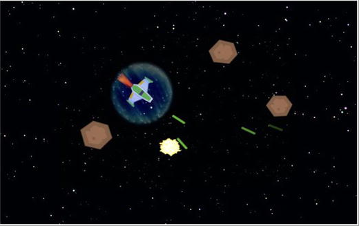

# Game: Space Rocks

The player controls a spaceship , whose goal is to shoot lasers and destroy rocks that are flying around the screen.

**Controls**

- Up and Down keys: accelerate spaceship
- Left and Right key: rotate spaceship
- Space bar: fire the laser
- X key: teleportation

## Setup

- **Java** 8
- **Gradle** Wrapper 6.7.1
- **LigGDX** 1.9.13: https://github.com/libgdx/libgdx
- **GDX Liftoff** 1.9.13: https://github.com/tommyettinger/gdx-liftoff

## Disclaimer

This "framework" is the result of reading, studying and learning the examples shown in the book "**Java Game Development with LibGDX**" by the author Lee Stemkoski.

- **Book site**: https://www.apress.com/gp/book/9781484233238
- **Source-code**: https://github.com/Apress/java-game-dev-LibGDX